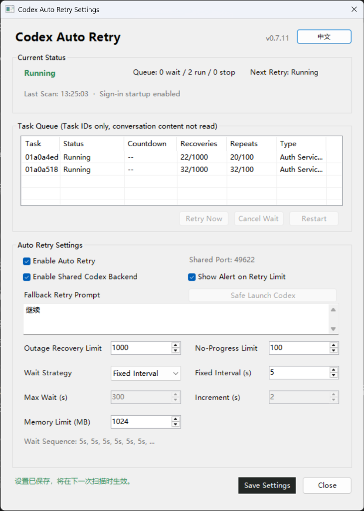

# Codex Auto Retry

[English] | [中文说明](README_zh.md)

Codex Auto Retry is an open-source reliability and automatic recovery tool for Codex on Windows. It monitors Codex task lifecycle events and safely resumes the exact interrupted task after recoverable provider, network, rate-limit, timeout, or empty-response failures while preserving working context, permissions, and runtime settings.

It runs as a local Windows watchdog service and does not require a per-task prompt. The watchdog provides a notification-area tray controller and an embedded Codex management panel (via MCP), while recovery remains independent of either interface being open. The latest Windows x64 release is available from the [GitHub Releases](https://github.com/sybxxx/codex-auto-retry/releases/latest) page.

For contribution boundaries and vulnerability disclosure, see [CONTRIBUTING.md](CONTRIBUTING.md) and [SECURITY.md](SECURITY.md).

---

## Table of Contents

- [Why Codex Auto Retry?](#why-codex-auto-retry)
- [Quick Start](#quick-start)
- [Recovery Behavior](#recovery-behavior)
  - [Exact-Task & Silent Continuation](#exact-task--silent-continuation)
  - [Goal Mode & Pause Protection](#goal-mode--pause-protection)
  - [Subagent Deterministic Recovery](#subagent-deterministic-recovery)
  - [Dual Safety Limits & Backoff Strategies](#dual-safety-limits--backoff-strategies)
  - [Retryable & Non-Retryable Fault Boundaries](#retryable--non-retryable-fault-boundaries)
- [User Interfaces](#user-interfaces)
  - [Windows Tray Controller](#windows-tray-controller)
  - [Embedded Management Panel (MCP)](#embedded-management-panel-mcp)
- [Safety and Privacy](#safety-and-privacy)
- [Installation and Maintenance](#installation-and-maintenance)
- [Fail-Open Shared Backend Safety](#fail-open-shared-backend-safety)
- [Limitations](#limitations)
- [Maintainer](#maintainer)

---

## Why Codex Auto Retry?

Long-running Codex work can be interrupted after tools have already executed or after a provider has accepted a request. Codex Auto Retry is designed to continue that same task without creating a replacement conversation, replaying completed side effects, changing the task on screen, or leaving a dead global endpoint.

| Dimension | Without Codex Auto Retry | With Codex Auto Retry |
| :--- | :--- | :--- |
| **Transient Failures** | Task aborts; requires manual restart or prompt resubmission | **Automatically detected & resumed with bounded backoff** |
| **Conversation Context** | Often requires starting a new thread; lost history & context | **Exact-task resumption; preserves full history & parameters** |
| **Tool Side Effects** | Re-sending prompts risks replaying completed file/DB changes | **Continues in-place; completed tools are never re-executed** |
| **User Disruption** | Error popups steal focus and interrupt ongoing thought | **Silent background recovery; zero stolen focus or screen changes** |
| **Runaway Protection** | Manual retries can enter infinite loops or drain API quota | **Dual safety limits (outage & consecutive) + circuit breakers** |

### Key Capabilities

- **Exact-task recovery**: Resumes the original Codex thread and keeps its working directory, model/provider, permissions, and reasoning settings.
- **Bounded operation**: Separates recovery and no-progress limits, applies a time circuit breaker, and stops with an explicit reason when a local channel is unavailable.
- **Current Desktop compatibility**: Supports current rollout filenames and the official Windows IPC owner route (`\\.\pipe\codex-ipc`), with the plugin-owned WebSocket as an optional verified path.
- **Fail-open safety**: Shared backend mode is opt-in; normal Codex startup uses its official backend when the optional recovery path is unavailable.
- **Privacy-conscious state**: Retry decisions retain lifecycle metadata only; conversation text, tool contents, credentials, and response bodies are not stored for recovery.

---

## Quick Start

1. **Download**: Grab the latest Windows x64 ZIP from [Releases](https://github.com/sybxxx/codex-auto-retry/releases/latest).
2. **Extract**: Extract it to a standard local folder (do not run directly from inside the archive preview).
3. **Install**: Fully close Codex, then double-click `安装.cmd`. The installer verifies the package and starts the watchdog service.
4. **Verify**: Open Codex and create a new task. The watchdog will automatically detect active tasks. You can also say `打开 Codex Auto Retry 管理面板` to open the embedded control panel.
5. See [Windows installation notes](release/windows/README-安装说明.txt) for route verification, shared backend details, and safe-launch behavior.

---

## Recovery Behavior

### Exact-Task & Silent Continuation

- **In-Process Resumption**: Rejoins the exact failed task through the Codex App process that is already running. Codex Desktop and the watchdog are two clients of one local shared app-server, so recovery does not open a task link, focus Codex, change the task currently on screen, or create a hidden `codex exec resume` task.
- **Thread Settings Integrity**: The official IPC recovery request preserves the current collaboration-mode model and reasoning settings (required by modern Codex Desktop). It restores the failed task with its latest working directory, workspace roots, model, provider, service tier, reasoning settings, personality, approval routing, and effective permission profile instead of applying generic App defaults.
- **Clean Dialogue**: In a normal conversation, it starts an empty-input continuation in that same task. The original request and completed tool results stay in context, while no new user-message bubble is added and the composer draft is untouched.
- **Fallback Compatibility**: Uses the configured fallback retry text (default: `继续` / `Continue`) only as a narrow compatibility fallback when Codex explicitly rejects empty-input turns. It never rolls back and resends the failed turn, preventing duplicate tool execution.
- **Rollout Schema Support**: Supports current Codex rollout names in both `thread-id.jsonl` and `thread-id_turn-id.jsonl` forms. The persistent thread ID is kept as the queue key; older turn-keyed state is migrated and duplicate entries for the same task are merged on startup.
- **Concurrency**: Keeps separate retry state for every task and can dispatch up to four due tasks independently by default. If a failed task is already running, its retry remains queued and will re-check later instead of canceling.

### Goal Mode & Pause Protection

- **Native Goal State**: In goal mode, uses Codex's native goal state and activates only a blocked goal that can be attributed to the same provider failure. Codex then creates the continuation turn itself.
- **Turn Adoption**: If an active goal creates another turn immediately after an empty reply, that turn is adopted into the same bounded recovery chain instead of being mistaken for new manual work.
- **Authoritative Pauses**: Treats a user or AI pause (including a goal waiting for user review) as authoritative. A pause during the failed turn, countdown, or controller startup cancels recovery; only an explicit later `active` goal update clears the goal hold.
- **Pre-existing Pause Isolation**: If the pause predates a later user-started conversation turn, a provider failure in that later turn may be silently continued while the goal remains paused and unchanged.
- **Fail-Closed Goals**: Never converts completed, usage-limited, budget-limited, or unknown goal states into a normal-conversation `continue` turn.

### Subagent Deterministic Recovery

- **Exact Existing Child Continuation**: For an empty reply from an internal subagent, appends one deterministic recovery event to its parent and silently continues the exact existing child thread.
- **Parent State Restoration**: An unloaded parent is first restored with its own persisted task settings before event injection.
- **Sole Wake-Up Owner**: The watchdog remains the sole wake-up owner for that event. The event explicitly forbids creating a replacement child; live child state, persisted notification acknowledgement, and turn correlation prevent duplicate continuation or duplicate Agent creation. Other child failures remain owned by the parent workflow.

### Dual Safety Limits & Backoff Strategies

To prevent runaway retry loops and excessive resource consumption, two independent safety limits are enforced:

1. **`本次故障恢复` (`Recoveries This Outage`)**: Bounds all automatic recovery attempts during a single persistent outage (default: 15, configurable from 1 to 1000).
2. **`连续无进展` (`Consecutive No Progress`)**: Bounds consecutive retries that produce neither a visible assistant reply nor a completed tool result (default: 5, configurable from 1 to 100).

- **Reset Rules**: A successful completion or a new user turn clears both counters; visible progress clears only the consecutive no-progress count.
- **Exhaustion Handling**: When an active goal reaches either limit through repeated empty replies, the watchdog retains the exhausted entry, marks that goal as `blocked`, and notifies: `目标连续空回复达到上限，目标恢复已停止` (*Goal consecutive empty-reply limit reached, goal recovery stopped*).
- **Backoff Strategies**: Supports fixed, linear, or doubling (exponential) delays capped at a configurable maximum. Linear waits add a configurable number of seconds each time. Increasing waits follow the consecutive no-progress count, so visible progress resets the delay sequence.
- **Turn Correlation**: Correlates the new `task_started` turn ID with its matching `task_complete`. An unrelated successful turn cannot falsely mark a retry as recovered.

### Retryable & Non-Retryable Fault Boundaries

- **Retryable Faults**:
  - Network failures, connection resets, and request timeouts;
  - HTTP 5xx server errors;
  - Rate limits and temporary capacity exhaustion;
  - Structured CC Switch `cc_switch_upstream_error` wrappers (when `upstream_status` is 400 and cause is `Upstream request failed`);
  - Interrupted streams;
  - "Empty responses" (HTTP 200 returned but no final model output generated);
  - Temporarily unavailable authentication services (within a lower, bounded safety limit).
- **Non-Retryable Faults (Fail-Closed)**:
  - User cancellation or abort;
  - Client-side invalid requests and ordinary HTTP 400/404 errors;
  - Missing model declarations;
  - Context length / token limit exceeded errors;
  - Policy, permission, and approval rejections.
- **Process Exit Safeguard**: If Codex App exits, the watchdog stops the affected retry immediately without consuming another provider attempt, preventing countdowns against a closed application.

---

## User Interfaces

### Windows Tray Controller

The watchdog runs as a single lightweight background process with a notification-area icon in Windows.

<!-- Screenshot placeholder: Tray controller -->
<!--  -->

- **Hover Tooltip**: Displays the current status (running, paused, waiting, active, stopped) and live countdown for the nearest pending retry.
- **Explorer Restart Recovery**: If Windows Explorer restarts, the watchdog automatically re-registers the tray icon and restores current state.
- **Double-Click**: Opens the graphical settings window.
- **Right-Click Context Menu**: Allows quick pausing/resuming of dispatch, opening settings, or exiting the watchdog.

The settings window allows configuring:
- Recovery limits (`Recoveries This Outage` and `Consecutive No Progress`);
- Delay curves (fixed, linear increment, or doubling backoff, with custom initial and max caps);
- Fallback retry text (up to 500 characters);
- Watchdog notification preferences;
- One-click Chinese/English localization toggle.

  

### Embedded Management Panel (MCP)

Users can open the management panel directly inside Codex by asking:
> `打开 Codex Auto Retry 管理面板` *(Open Codex Auto Retry Management Panel)*

  

Built with vanilla TypeScript and embedded into the Go MCP binary via Go `embed`, the panel requires no Node.js runtime and performs zero external network requests. It displays:
- Watchdog health, monitored session directories, and timestamp of last scan;
- Active and pending retry queues with real-time countdown timers;
- Immediate retry (`Retry Now`) and cancellation controls;
- Exhausted task list with a one-click attempt budget reset button;
- Global pause/resume toggle.

---

## Safety and Privacy

- **Zero Content Logging**: The scanner processes only lifecycle records and boolean progress flags. Conversation messages, user prompts, assistant outputs, tool inputs/outputs, credentials, and response bodies are **never decoded, logged, or stored**.
- **Settings Reader Allowlist**: Immediately before recovery, a strict allowlist decodes only essential context (`working_directory`, `workspace_roots`, `model`, `provider`, `service_tier`, `reasoning_effort`, `personality`, `approval_policy`, and `permission_mode`). All other fields are discarded.
- **Atomic Persistence**: Runtime state is written atomically. Windows file sharing violations (from virus scanners or indexers) are retried gracefully without crashing.
- **Resource Caps**: The state file enforces hard limits of 20,000 processed events, 2,000 file cursors, and 500 inactive task records, with a maximum file size cap of 8 MB. Operational logs rotate at 5 MB (keeping up to 3 backups). Individual automatic recovery chains feature a 30-minute hard circuit breaker.

---

## Installation and Maintenance

### End-User Installation

1. Download and extract the self-contained Windows x64 release ZIP.
2. Fully close Codex App, then double-click `安装.cmd`.
3. The installer verifies file hashes via SHA-256, registers current-user startup, deploys the local watchdog under `%LOCALAPPDATA%\CodexAutoRetry`, and registers the Codex plugin.
4. Neither administrator rights nor Go/Node.js dependencies are required.

### Administrative & Break-Glass Tools

- `启动管理器.cmd`: Launches a windowed startup manager (without leaving a command console) showing exact startup commands, supervisor status, heartbeat, and Windows `StartupApproved` status.
- `安全停用.cmd`: One-click emergency script that immediately disables shared mode, clears plugin-owned registry values, and restores Codex to official direct execution.
- `卸载.cmd`: Cleanly uninstalls the watchdog and plugin while preserving user settings and logs by default. Run `.\uninstall-release.ps1 -RemoveData` to perform a full cleanup.

  

---

## Fail-Open Shared Backend Safety

The watchdog is built with a **Fail-Open** guarantee:

- **Opt-In Shared Mode**: A fresh install defaults `shared_app_server_enabled` to `false` and does not set global system environment variables.
- **Modern Official IPC**: On recent Windows Desktop versions of Codex, the watchdog detects the official `\\.\pipe\codex-ipc` named-pipe router, allowing direct in-place retry without modifying global environments or redirecting ports.
- **Legacy Fallback Route**: For older Codex Desktop versions requiring a local loopback server, the launcher verifies ownership, checks loopback health, and dynamically assigns a free port near `49621` if conflicts occur.
- **Safe Recovery**: If the watchdog crashes or encounters an invalid state, it fails open, allowing Codex to start normally with its official backend without hanging.

---

## Limitations

- **Authentication**: Permanently revoked or expired logins cannot be bypassed; user re-authentication is required.
- **Runtime Requirement**: Codex App must be open for retries to dispatch.
- **OS Support**: Tray controller and IPC routes require Windows 10 or Windows 11 (x64).
- **Completion Notifications**: The `ChatGPT finished a turn` notification is emitted by Codex App before an empty-response failure can be classified. To suppress it, use Codex's native **Settings > General > Notifications > Turn completion notifications > Never** setting.

---

## Maintainer

Maintained by [`sybxxx`](https://github.com/sybxxx) under the **TQY Local Tools** project.

Licensed under the [MIT License](LICENSE).
