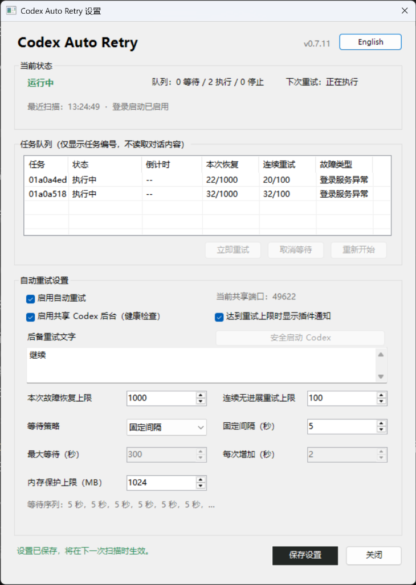
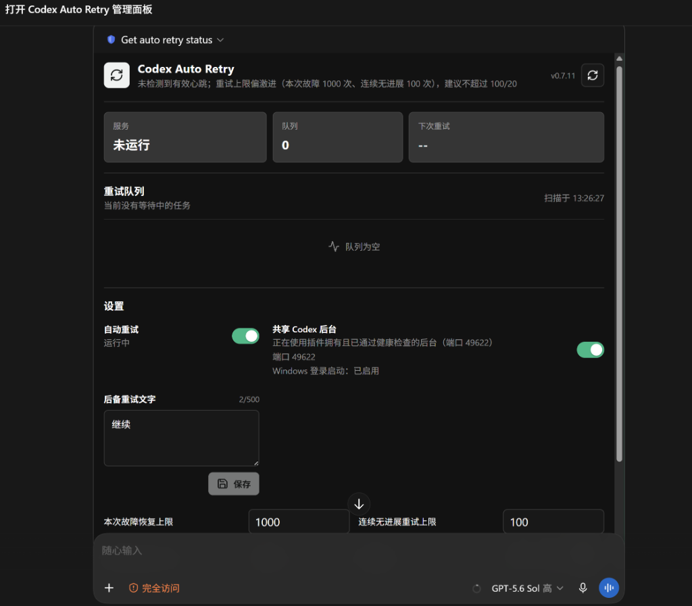
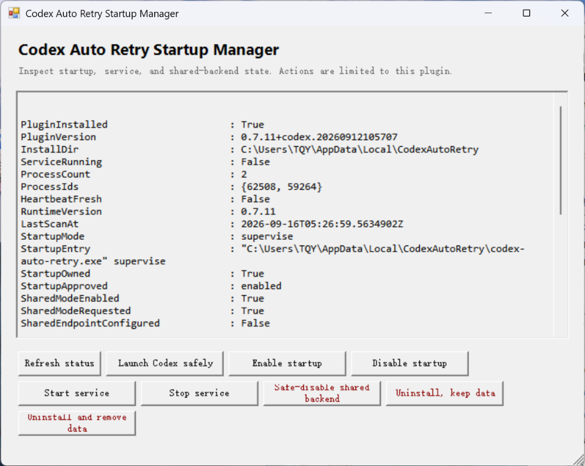

# Codex Auto Retry

[English](README.md) | [中文说明]

Codex Auto Retry 是一款专为 Windows 平台 Codex 打造的开源可靠性守护与原地自动恢复工具。它可以在后台静默监测 Codex 任务生命周期，在遭遇网络波动、服务限流（Rate Limit）、请求超时、服务器异常或模型空回复时，**在原任务中安全、自动地原地恢复运行**，同时完整保留任务工作区、模型配置与推理参数。

该工具作为 Windows 本地后台轻量守护服务运行，无需在每个 Codex 会话中手动引用或重复发送提示词。同时提供任务栏通知区域托盘控制器以及 Codex 原生内嵌管理面板（基于 MCP 协议），界面开闭均不影响后台自动恢复。

最新 Windows x64 二进制发布包可前往 [GitHub Releases](https://github.com/sybxxx/codex-auto-retry/releases/latest) 页面直接下载。参与贡献与安全漏洞披露准则请参见 [CONTRIBUTING.md](CONTRIBUTING.md) 与 [SECURITY.md](SECURITY.md)。

---

## 目录

- [为什么需要 Codex Auto Retry？](#为什么需要-codex-auto-retry)
- [快速上手](#快速上手)
- [核心恢复行为](#核心恢复行为)
  - [原地静默续跑（Exact-Task Recovery）](#原地静默续跑exact-task-recovery)
  - [目标模式与暂停保护（Goal Mode）](#目标模式与暂停保护goal-mode)
  - [子代理确定性恢复（Subagent Recovery）](#子代理确定性恢复subagent-recovery)
  - [双重安全上限与退避策略](#双重安全上限与退避策略)
  - [可重试与不可重试边界](#可重试与不可重试边界)
- [用户交互界面](#用户交互界面)
  - [Windows 任务栏托盘控制器](#windows-任务栏托盘控制器)
  - [Codex 内嵌管理面板（MCP Apps）](#codex-内嵌管理面板mcp-apps)
- [隐私与安全保障](#隐私与安全保障)
- [安装、维护与卸载](#安装维护与卸载)
- [故障安全设计（Fail-Open）](#故障安全设计fail-open)
- [使用限制与说明](#使用限制与说明)
- [维护者与开源协议](#维护者与开源协议)

---

## 为什么需要 Codex Auto Retry？

在长时间运行 Codex 执行复杂编码或自动化工作流时，任务经常因模型上游瞬断、并发限流或网络抖动而中断。传统的应对方式不仅繁琐，而且容易破坏既有工作流：

| 体验维度 | 未安装 Codex Auto Retry | 安装 Codex Auto Retry 之后 |
| :--- | :--- | :--- |
| **突发网络/超时中断** | 任务直接报错终止，必须人工介入刷新 | **后台静默捕获，按退避策略自动重试** |
| **会话与上下文保持** | 往往被迫新建会话，丢失之前的上下文记忆 | **原地继续（Exact-Task），完整保留前文与推理配置** |
| **工具调用副作用** | 重新发送整段提示词容易重复执行文件写入等操作 | **从中断点继续推进，绝不重复回滚执行已成功的工具** |
| **用户工作干扰** | 频繁弹出错误窗口，抢夺输入焦点 | **零弹窗干扰，后台无感静默恢复** |
| **防死循环与配额保护**| 容易因无脑重试陷入死循环耗尽 Token | **双独立上限（单次故障/连续无进展）+ 30分钟全局熔断** |

### 核心亮点
- **精准原地恢复**：复用既有 Codex 会话线程，原汁原味保留工作目录、权限策略、模型与思考强度设置。
- **严格受控防死锁**：区分“单次故障恢复总上限”与“连续无进展上限”，并设有 30 分钟全局超时熔断。
- **现代化桌面客户端兼容**：完美支持当前 Codex 桌面版的 `thread-id_turn-id.jsonl` 会话规范，并原生识别官方 `\\.\pipe\codex-ipc` 命名管道恢复通道。
- **故障安全保障（Fail-Open）**：即使守护服务遇到异常或关闭，Codex 也会自动回退到官方独立模式启动，绝不影响正常使用。
- **隐私保护至上**：决策仅依赖任务生命周期元数据与布尔进度标记，绝不记录、解析或持久化任何对话正文、代码输入输出或 API 密钥。

---

## 快速上手

1. **下载**：从 [Releases](https://github.com/sybxxx/codex-auto-retry/releases/latest) 下载最新的 Windows x64 绿色免安装 ZIP。
2. **解压**：解压到普通的本地文件夹（请勿在压缩包预览中直接运行）。
3. **安装**：完整退出 Codex 后，双击运行 `安装.cmd`，等待提示安装成功。
4. **验证**：打开 Codex App 并新建一个任务，发送提示词：`打开 Codex Auto Retry 管理面板` 即可呼出内嵌监控面板。
5. 更多通道检查与安全启动行为，请参阅随包附带的 [Windows 安装说明](release/windows/README-安装说明.txt)。

---

## 核心恢复行为

### 原地静默续跑（Exact-Task Recovery）

- **进程内无缝续接**：通过已在运行的 Codex 桌面端直接接入。Codex 与守护服务作为本地共享应用服务的两个客户端，恢复时不弹窗、不夺取焦点、不切换屏幕上正在查看的任务，更不会生成多余的外部恢复任务。
- **会话上下文完整性**：恢复请求严格保留协作模式下的模型、推理努力度（Reasoning Effort）、工作区根目录、人格设定以及审批权限策略，绝不用默认通用设置覆盖。
- **纯净对话流**：在普通对话中发起空输入（Empty-Input）原地续跑。原始请求与已完成的工具执行结果均留在上下文中，不额外插入多余的用户气泡，也不改动输入框草稿。
- **后备文字兼容机制**：仅当用户的 Codex 版本明确拒绝空输入回合时，才会回退发送配置的后备重试文字（默认 `继续`）。绝不回滚并重新发送原始故障轮次，杜绝重复产生文件写入或外部副作用。
- **会话持久化兼容**：原生兼容 `thread-id.jsonl` 及新版 `thread-id_turn-id.jsonl` 命名格式；旧版本以回合 ID 记录的待重试队列会在启动时自动平滑迁移合并。
- **多任务独立并发**：为每个任务维护独立的重试状态，默认可独立调度最多 4 个到期的故障任务。若故障任务当前仍有操作在运行，自动排队延后等待而非取消。

### 目标模式与暂停保护（Goal Mode）

- **原生目标激活**：针对 Codex 原生目标模式，仅激活由同一上游故障导致受阻的目标，由 Codex 原生生成后续推进回合。
- **原生轮次自适应**：若激活的目标在空回复后立即自动发起新轮次，该轮次会被纳入同一受控恢复链中，不会被误判为人工手动操作而重置预算。
- **权威暂停保护**：将用户或 AI 的主动暂停（例如等待人工审查确认）视为绝对权威指令。故障轮次或倒计时期间的暂停会立即终止自动重试；仅有后续明确的 `active` 状态更新才能解除暂停锁定。
- **已暂停目标的独立隔离**：若目标暂停先于后续用户发起的新会话轮次，该新轮次发生上游故障时仍可独立静默重试，同时目标继续保持暂停。
- **安全失败机制**：已完成、超出用量限制、超出预算限制或未知状态的目标严格安全失败，绝不强行转为普通对话的 `continue` 轮次。

### 子代理确定性恢复（Subagent Recovery）

- **保留现有子线程**：当内部 Subagent 出现空回复故障时，向父级追加一个确定性的恢复事件，并在既有的子线程中静默继续。
- **父级上下文还原**：若父级任务已从内存卸载，先按其持久化的任务配置还原后再注入事件。
- **唯一唤醒归属**：守护服务作为该事件的唯一唤醒者，明确禁止生成重复的子任务。通过实时子线程状态、持久化通知确认及回合关联机制，彻底避免并发重复续跑或创建多余 Agent。

### 双重安全上限与退避策略

从 0.7.12 开始，两个设置面板均显示“登录异常恢复上限”（`auth_max_attempts`，默认 6，范围 1–1000）。普通登录异常与两个通用上限取较小值；临时 `auth_unavailable` 故障仍使用通用上限。分类变化或调低上限不会缩小已累计次数，例如 `19/6` 表示实际已重试 19 次后，适用上限降为 6；旧版已截断的历史计数不会推测还原。

为杜绝死循环重试和过度消耗 API 配额，内置两道独立安全防线：

1. **`本次故障恢复`（Recoveries This Outage）**：统计单次突发故障期间的所有自动恢复尝试总数（默认 15 次，可在 1~1000 间调整）。
2. **`连续无进展`（Consecutive No Progress）**：统计连续未产出任何可见助手文本回复或有效工具结果的重试次数（默认 5 次，可在 1~100 间调整）。

- **计数重置逻辑**：任务成功完成或用户手动发起新轮次时，两项计数同时清零；产生可见进展时，仅重置“连续无进展”计数。
- **耗尽阻断处理**：活跃目标因连续空回复达到任一上限时，守护服务保留该耗尽记录，将目标转为 `blocked`，并直观提示：`目标连续空回复达到上限，目标恢复已停止`。
- **灵活退避算法**：支持固定延时（Fixed）、等差递增（Linear）以及翻倍指数退避（Doubling），并设有最大延时封顶。递增等待随“连续无进展”次数增长，一旦出现实质进展立即重新开始延时序列。
- **回合精确关联**：通过将新生成的 `task_started` ID 与对应的 `task_complete` 进行关联比对，防止其他无关任务的成功误将故障任务标记为已恢复。

### 可重试与不可重试边界

- **可自动重试的故障类型**：
  * 网络中断、连接被重置与请求超时；
  * HTTP 5xx 服务器端故障；
  * 并发受限（Rate Limits）及官方容量临时饱和；
  * 结构化 CC Switch 报错（`cc_switch_upstream_error` 上游状态为 400 且原因为 `Upstream request failed`）；
  * 流式输出被意外打断；
  * “空响应”（HTTP 200 成功返回但模型无任何文本产生）；
  * 认证服务临时不可用（遵循已配置的两个通用上限）。
- **不可自动重试的边界（安全失败，直接终止）**：
  * 用户主动取消或放弃任务；
  * 客户端请求格式错误（普通 HTTP 400/404 等）；
  * 所请求的模型不存在；
  * 上下文长度超出模型硬性限制；
  * 安全审查（Policy）、权限拒绝以及审批被驳回。
- **主程序退出保护**：若监测到 Codex 桌面客户端退出，受影响任务立即停止倒计时，不空耗重试机会，待 Codex 重新启动后可手动重新激活。

---

## 用户交互界面

### Windows 任务栏托盘控制器

守护服务在后台以单实例轻量进程运行，驻留在 Windows 任务栏通知区域。

<!-- 截图占位符：系统托盘 -->
<!--  -->

- **状态悬浮提示**：鼠标悬停在托盘图标上，即刻显示当前守护状态（运行中、暂停、等待中、活跃、已停止）及最近任务的重试倒计时。
- **资源管理器崩溃自愈**：若 Windows Explorer 意外重启，守护服务会自动重新注册托盘图标并恢复实时状态。
- **双击交互**：双击托盘图标即可打开图形设置窗口。
- **右键快捷菜单**：支持快速一键暂停/继续任务调度、打开设置或退出守护程序。

在设置窗口中可以轻松配置：
- 两项独立重试次数上限（本次故障恢复上限、连续无进展重试上限）；
- 退避曲线（固定间隔、线性递增、指数翻倍）与最大等待封顶；
- 后备重试文本（限 500 字符）；
- 达到重试上限时的 Windows 系统气泡提醒开关；
- 简体中文 / 英文一键无缝切换。

  

### Codex 内嵌管理面板（MCP Apps）

直接在 Codex 内部通过自然语言随时呼出：
> `打开 Codex Auto Retry 管理面板`

  

面板使用轻量 TypeScript 构建并通过 Go 原生 `embed` 嵌入到 MCP 二进制文件中，无需安装 Node.js 环境，运行时零外网网络请求：
- 实时展示守护服务状态、监控的会话目录与最近扫描时间戳；
- 队列视图：展示所有等待中与运行中的任务及精确秒级倒计时；
- 便捷操作：支持对等待中任务一键“立即重试（Retry Now）”或手动取消；
- 耗尽任务重置：直观列出因达到上限而停止的任务，可一键刷新重试预算重新开始；
- 全局暂停开关。

---

## 隐私与安全保障

- **零会话内容窥探**：事件扫描器仅读取任务生命周期标记与布尔型进展状态。用户的对话正文、提示词、助手回复、工具出入参、账号凭据及网络响应体**一律不解码、不记录、不持久化**。
- **严格白名单读取**：仅在原地恢复执行前一刻，解码必要的运行环境参数（工作目录、工作区根目录、模型、服务层级、推理努力度、人格设定及权限模式），其余字段全部丢弃。
- **原子化文件写入**：运行时状态采用原子写操作，遇杀毒软件或搜索索引器导致的 Windows 临时文件占用会自动优雅重试，绝不崩溃退出。
- **资源消耗硬性封顶**：状态文件硬性限制最多保留 20,000 个已处理事件、2,000 个文件游标和 500 条非活跃任务记录，文件超过 8 MB 强制拒绝膨胀；运行日志 5 MB 滚动备份（最多保留 3 份）；单次恢复链设有 30 分钟硬性熔断。

---

## 安装、维护与卸载

### 普通用户安装

1. 从 Release 页面下载 ZIP 包并解压至本地普通目录。
2. 完整退出 Codex，双击运行 `安装.cmd`。
   如果仍在运行，安装器会弹出中文提醒。保存并完全退出后点击“重试”；取消或五分钟超时不会修改已安装程序，也不会强制结束 Codex。
3. 安装器会自动校验 SHA-256 哈希、注册当前用户开机自启、将二进制文件部署于 `%LOCALAPPDATA%\CodexAutoRetry` 并自动向 Codex 注册插件。
4. 全程无需管理员（UAC）权限，亦无需 Go 或 Node.js 依赖。

### 运维与紧急恢复工具

- `启动管理器.cmd`：以无命令行黑框的独立窗口形式启动，直观查看开机启动命令、supervise 监督进程、心跳及 Windows `StartupApproved` 批准状态。
- `安全停用.cmd`：一键应急脱困脚本。立即停用共享后台模式，清理插件注册表与本地端口，使 Codex 彻底恢复至官方纯净环境。
- `卸载.cmd`：干净卸载守护进程与插件。默认保留配置与日志以备重新安装；如需彻底清除，可在 PowerShell 中运行 `.\uninstall-release.ps1 -RemoveData`。

  

---

## 故障安全设计（Fail-Open）

守护程序贯彻 **安全失败（Fail-Open）** 原则：

- **共享模式完全自愿选择**：初始安装默认不启用共享后台（`shared_app_server_enabled: false`），不向 Windows 写入任何全局环境变量。
- **原生官方 IPC 通道**：对于支持的 Codex 桌面版本，验证通过的官方 `\\.\pipe\codex-ipc` 通道独立于共享后台开关。关闭共享模式不等于暂停自动重试；暂停请使用自动重试开关。
- **通道恢复后重新排队**：符合安全条件的近期未发送任务，可回到原恢复链，保留计数和三十分钟时限；新用户回合、取消、正在运行的任务和发送结果不明的情况不会自动重新唤醒。
- **安装验证与回滚**：先检查 CLI 列表命令，最后核对准确插件版本；普通警告不再被当作失败。失败时恢复插件与后台文件并保持服务停止；回滚未完成时保留备份和恢复记录，不删除聊天数据。
- **兼容模式回退机制**：针对需要本地回环端口的旧版本 Codex，启动器会严格执行所有权与心跳校验，端口冲突时自动寻找相邻可用端口。
- **异常自愈机制**：若守护程序发生意外或未启动，Codex 依然能够毫无阻碍地使用官方直连模式启动，绝不会导致主程序挂起或无法使用。

---

## 使用限制与说明

- **账号登录状态**：账号永久注销、授权撤销或登录已彻底失效的情况无法绕过，必须在 Codex 中手动重新登录。
- **主程序依赖**：Codex 桌面应用必须在运行状态下才能分发重试。
- **操作系统要求**：托盘控制器与原生命名管道通道支持 Windows 10 与 Windows 11（x64）。
- **完成通知说明**：Codex 自带的“ChatGPT finished a turn”弹窗产生于空回复被识别之前，无法单独拦截。若需彻底关闭，可在 Codex 的 **“设置 > 常规 > 通知 > 轮次完成通知”** 中选择 **“从不”**。

---

## 维护者与开源协议

本项目由 [`sybxxx`](https://github.com/sybxxx)（TQY Local Tools）独立维护。

项目采用 [MIT 开源许可证](LICENSE).
